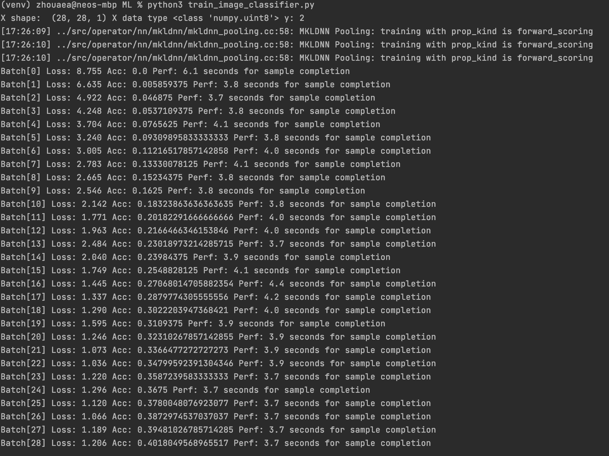
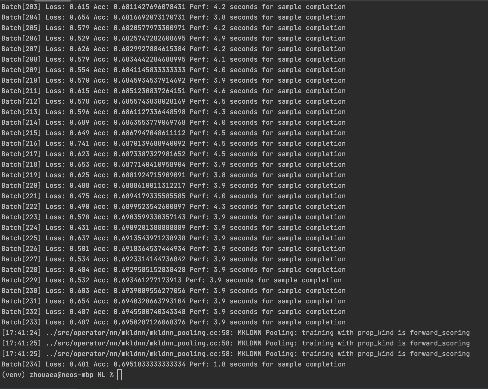

# ML Practice
This repository contains my practice training machine learning models. The end goal of this project is to be able to
train advanced computer vision models using prebuilt neural networks.

I am learning mostly from [AWS Computer Vision: Getting Started with GluonCV](https://www.coursera.org/learn/aws-computer-vision-gluoncv/home/welcome) on Coursera and the GluonCV documentation.

## File Structure
### Pretrained Image Classifier 
####image_classifier_pretrained.py
I used a prebuilt ResNet50 neural network pretrained on the ImageNet1K dataset to classify jpgs I found on the internet
(stored in the `Images` folder).

I used this project to learn how images are represented with numpy and mxnet ndarrays, how to preprocess and feed data 
into an image classifier, and how to interpret outputs that comes out of an image classification network.

### Pretrained Object Detector
####object_detector_pretrained.py
I used a prebuilt YoloV3 neural network pretrained on the COCO dataset to detect and draw bounding boxes around objects in jpgs I found on the internet.

I used this project to learn how images are represented with numpy and mxnet ndarrays, how to feed data into an object
detector, and how to interpret data that comes out of a object detection network. I used gluoncv's plot_bbox function to visually display
the bounding boxes calculated by the neural network results.

### Autograd
####autograd.py
I learned that NN training has three steps: forward, where a loss function is calculated for the network; backward,
where the gradients of the loss function are calculated; and optimize, where the gradients with respect to each parameter in the the loss function are used
to edit the weights and biases of a neural network in order to make the output of the NN more accurate.

In this projected I computed the backward step using the MXNET autograd function to efficiently calculate the gradients of a simple function and
composition of functions via backpropogation.

### Gluon Trainer
####gluon_trainer.py
After learning how to calculate gradients for a composition of functions in Autograd, I used the gradients in conjunction
with a simple dense neural network and a gluon trainer to optimize the network and model `2x + 1` given some inputs and outputs.

### Dataset
####dataset.py
A robust data structure that supports fast indexing and efficient storage are essential for ML. I learned how to load different types of data into a gluon dataset with ndarrays, preloaded gluon datasets, and folders on my computer.

### Data Preprocessing
###data_preprocessing.py
I learned how to use gluon transform objects to manipulate data in gluon datasets. 
I can now create custom transformations to augment data for more robust training, or simply modify data to feed it into a network.

### Data Loader
####data_loader.py
I learned how a gluon data loader partitions data in a gluon dataset and how to iterate through the partitions. 

### Clothing Classifier Trainer
####clothing_classifier_trainer.py
I combined everything I learned previously to finally train my own ResNet model on the Fashion MNIST dataset, saving the 
model parameters into a .param file in the `Trained Models` folder for later usage.

Below are the model statistics for a single training epoch on the FashionMNIST dataset.

#### Beginning of Epoch

#### End of Epoch

### Clothing Tester
#### clothing_tester.py